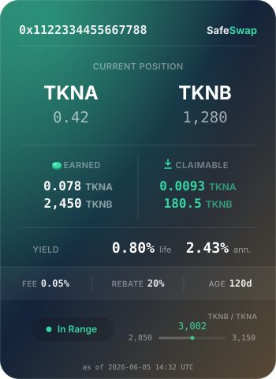

# SafeSwap

### Swappers keep more. LPs earn more.

> 🔗 **Live testnet demo → [safeswap.spot](https://safeswap.spot/)** — connect a wallet on **Unichain Sepolia** (a testnet) and try gasless, MEV-protected swaps with testnet funds. No install, no approvals, no real money. Not deployed to mainnet yet.

SafeSwap is a [Uniswap V4](https://github.com/Uniswap/v4-core) protocol that protects traders from MEV and pays liquidity providers the repricing revenue normal AMMs leak to arbitrage bots.

Normal pools leak value in two places:

1. **Swappers leak value through public execution.** If a swap is visible before it executes, bots can wrap it, move the price, and sell back into it.
2. **LPs leak value through stale-price repricing.** When the outside market moves, arbitrageurs update the pool and keep the repricing surplus that LP liquidity made possible.

SafeSwap fixes both at the protocol layer.

* Swaps and liquidity actions are routed through [BondRoute](https://github.com/rafajaw/BondRoute), a bonded commit-reveal primitive that hides intent before execution.
* Price-moving swaps pay a configurable share of their repricing surplus back to LPs through Uniswap V4 dynamic fees.
* Gasless EIP-7702 UX turns the protected flow into one human-readable signature per swap.

No off-chain sequencer. No oracle. No privileged executor in the core pool path.

---

## Why this matters

Normal AMMs quietly subsidize two forms of extraction.

**Traders leak information before execution.** A public pending swap tells bots what you are buying, how much you are buying, and where your slippage limit probably is. That is the raw material for sandwiches and other mempool games.

**Liquidity providers leak repricing value.** When the market price moves, an arbitrageur trades against the stale pool until it matches the outside market. The pool gets updated, but the arbitrageur keeps the spread. LPs supplied the liquidity that made the repricing possible, yet normal AMMs do not charge specifically for that repricing value.

SafeSwap closes both leaks:

* Swappers stop exposing useful orders before execution.
* LPs earn the base swap fee plus a configurable share of the repricing surplus.
* Arbitrageurs can still update stale pools, but the free lunch is no longer free.

> [!TIP]
> **MEV protection + LVR rebate = both sides earn more.** Swappers keep more of their trade. LPs earn more from the liquidity they already provide.

---

## One signature per swap — gasless, no approvals

Commit-reveal is two on-chain transactions, a few seconds apart on most chains. SafeSwap hides that behind an [EIP-7702](https://eips.ethereum.org/EIPS/eip-7702) delegate, so for the user it becomes:

```text
sign once → done
```

No gas. No token approvals. No visible second transaction.

### One-time setup

The user signs once to point their EOA at the SafeSwap 7702 delegate:

```text
Set up SafeSwap on your account
Delegate to:  SafeSwap  (0x77020000…39620)
Note:         no tokens are moved by this signature
```

### Per swap

The user signs one human-readable EIP-712 message.

SafeSwap renders the message as a plain receipt through its on-chain signing descriptor, so the wallet can show role-named fields, full-precision amounts, and raw token addresses instead of a cryptic hash:

```text
sS__SWAP__Ss

Pay:      = 1.25 WETH
Receive:  >= 4,218.5 USDC
Pool:     0.3% base fee | 50% rebate | tick spacing 60

Warning:  >> Check protocol and token addresses <<

USDC:     0xA0b86991c6218b36c1d19D4a2e9Eb0cE3606eB48
```

That signature is the whole user flow.

Behind it, a relayer submits both BondRoute transactions — create and execute — and the 7702 delegate performs the token approvals the swap needs. The signature is bound to the commitment, so the relayer cannot alter the trade or pull funds beyond what was signed.

Prefer to self-drive? Users can still submit the two BondRoute transactions directly.

The honest comparison:

| Normal DEX UX                                | SafeSwap UX                                  |
| -------------------------------------------- | -------------------------------------------- |
| Approve token → sign swap → pay gas → wait   | Sign once → done                             |
| Public pending swap                          | Sealed commitment                            |
| MEV protection mostly left to infrastructure | MEV protection enforced in the protocol path |

---

## Two leaks, two fixes

### 1. The sandwich → fixed by BondRoute

You send a USDC → ETH swap.

| Normal AMM                                                    | SafeSwap                                                                |
| ------------------------------------------------------------- | ----------------------------------------------------------------------- |
| Your pending swap exposes the trade before it executes.       | The trade is committed first as a sealed hash.                          |
| Bots read the token path, amount, and likely slippage.        | Bots cannot see path, amount, recipient, or limits from the commitment. |
| A bot buys before you, lets you fill worse, then sells after. | Execution happens only after the bond delay and reveal.                 |
| Slippage only bounds your worst acceptable fill.              | Slippage still bounds the fill, and the order was never public bait.    |

BondRoute is a commit → wait → reveal flow: you commit a hash plus a small refundable stake, then execute after a one-block or protocol-set delay. Bots cannot frontrun what they cannot see, and speculating on bonds costs real stake, so the attack stops paying.

SafeSwap does not claim prices cannot move. It claims your order is not exposed as a public, pre-execution target.

---

### 2. LVR → fixed by the repricing rebate

ETH ticks from **$3,000 → $3,030** on major venues. Your pool still reads **$3,000**.

| Normal AMM                                                     | SafeSwap                                                                                                      |
| -------------------------------------------------------------- | ------------------------------------------------------------------------------------------------------------- |
| An arb bot buys cheap ETH from the pool until it reads $3,030. | The same repricing can happen. The pool still needs to become fresh.                                          |
| The bot keeps the entire spread — that is LVR, paid by LPs.    | SafeSwap prices the swap's repricing surplus and rebates a configurable share to the LPs who served the move. |
| LPs are rebalanced through a stale price for free.             | The arb keeps the rest, so it still does the job and the pool stays fresh.                                    |
| LPs earn nothing specifically for repricing.                   | LPs capture most of the repricing value, natively, per swap.                                                  |

The rebate is paid as a native Uniswap V4 dynamic fee, so it lands **path-fairly** on exactly the LP ranges the swap crossed — no `donate`, no oracle, no keeper.

---

## What you get

| Participant                | Value                                                                                                                               |
| -------------------------- | ----------------------------------------------------------------------------------------------------------------------------------- |
| **Swappers**               | Sandwich and frontrun resistance by construction. The trade you sign is the trade that can execute.                                 |
| **Liquidity providers**    | A new revenue stream: a share of the repricing surplus that normally leaks to bots, on top of base swap fees.                       |
| **Builders / integrators** | Trustless and oracle-free pools; deterministic infrastructure; permissionless pool profiles; gasless UX available through EIP-7702. |

---

## Fees

A SafeSwap trade can carry three distinct costs:

1. **Base LP fee** — the pool's ordinary fee.
2. **Repricing LP fee** — variable, charged only when the swap moves the price enough to create measurable repricing surplus.
3. **SafeSwap protocol fee** — a fixed protocol fee.

Both LP fees go **100% to liquidity providers**.

The protocol fee is **10% of the base LP fee**, with a **0.01% floor**, taken from the swap output:

| Base LP fee | SafeSwap protocol fee | Fixed fee before repricing |
| ----------- | --------------------: | -------------------------: |
| 0.30%       |                 0.03% |                      0.33% |
| 0.09%       |                 0.01% |                      0.10% |
| 0.01%       |                 0.01% |                      0.02% |

The repricing LP fee is additional and variable. It applies only when a swap creates repricing surplus, and 100% of it goes to LPs.

The protocol fee accrues to the **SafeSwap treasury**: a per-chain address that can claim collected fees. The treasury may be an EOA, DAO, governance contract, fee splitter, or any other contract. The core protocol does not prescribe what the treasury does with the funds.

---

## Liquidity positions are investment instruments

Every SafeSwap LP position is an ERC-721 NFT that wraps a yield-bearing Uniswap V4 position — base fees **plus** the repricing rebate — into a single, transferable instrument. It can be held, transferred, or composed into other protocols like any ERC-721, and it renders **fully on-chain**: the position descriptor draws a self-contained card (pair, range, fees earned) so wallets and marketplaces show the real position, not a placeholder.



For a trader or investor, that turns liquidity into something you can actually hold as a product: MEV-protected, repricing-earning exposure, wrapped as a portable, legible asset.

---

## Built on BondRoute

SafeSwap does not reinvent MEV protection. It inherits it from [BondRoute](https://github.com/rafajaw/BondRoute).

BondRoute is an immutable singleton for bonded commit-reveal: a generic primitive for trustless fair play deployed to the same address on supported chains:

```text
0xb01d00000000440215e86e0A436f9b59FeB2F14a
```

Every SafeSwap swap and liquidity action is a BondRoute-protected call:

* intent hidden in a commitment hash
* small refundable stake
* mandatory reveal delay

That gives traders frontrun and sandwich resistance. It also makes systematic arbitrage splitting expensive: each slice needs its own stake, two transactions, and delay.

### Why BondRoute alone is not enough

BondRoute makes pool access protected, but a bonded arbitrageur can still move a stale pool and keep the repricing value.

The action is permitted, but not priced.

SafeSwap turns protected access into **priced** access: it tolls the repricing surplus and pays it to LPs.

---

## How the rebate works — technical

When a swap arrives, the hook runs in V4's `beforeSwap`.

1. **Simulate** the swap against current pool state using `contracts/Common/SwapSimulator.sol`.

2. **Estimate the repricing surplus**: the swap's output valued at the simulated post-swap price, minus the input actually paid.

   ```text
   surplus = output value at the post-swap pool price − input paid
   ```

   This is the price-impact area between the curve and the swap's terminal price — the local value created by moving the pool toward the external market.

   It is read from the **simulated post-swap price**, never from an external feed, so the mechanism is oracle-free.

   SafeSwap measures **displacement, not intent**:

   * large trade in deep liquidity → tiny price movement → tiny surplus → tiny fee
   * small trade in thin liquidity → larger price movement → larger surplus → larger fee

3. **Return** the dynamic fee from `beforeSwap`.

   ```text
   total LP fee = base LP fee + capture% × surplus
   ```

The fee is paid through Uniswap V4's native dynamic fee path. That is why it accrues path-fairly to the LP ranges crossed by the swap.

`capture%` is the share of the surplus paid to LPs, from **0% to 90%** in 10% steps.

It is not a rate on raw price movement. That distinction matters: a naive `rate × displacement × input` fee overcharges because price impact is an area under the curve, not a rectangle. SafeSwap defines capture against the measured surplus itself.

The **90% ceiling** leaves arbitrageurs at least 10% of the measured surplus, so repricing remains profitable and pools stay fresh.

> SafeSwap makes no claim the formula alone is splitting-proof. A single `beforeSwap` sees one swap's local surplus. The splitting deterrent is BondRoute: each slice needs its own commitment, stake, delay, and reveal.

---

## Architecture

| Component                  | Role                                                                                                    |
| -------------------------- | ------------------------------------------------------------------------------------------------------- |
| **`SafeSwapRouter`**       | Canonical BondRoute-protected router: swaps, hook registry, treasury.                                   |
| **`SafeSwapNft`**          | BondRoute-protected NFT that owns the V4 positions. The V4 position salt is the tokenId.                |
| **config hooks**           | Permissionlessly deployed EIP-1167 clones of `SafeSwapHookImpl`, one per `(base fee, capture)` profile. |
| **`SafeSwap7702Delegate`** | EIP-7702 delegate for gasless / sponsored interaction.                                                  |
| **descriptors**            | Human-readable signing and position metadata for better wallet and NFT UX.                              |

Each config hook's economics are encoded directly in its CREATE2 address as binary-coded decimal, plus the V4 permission bits:

```text
0x F d2 d1 d0 C r 0 …………………… PPPP
   │ └──┬──┘ │ └┬┘                └─ low 14 bits: V4 hook permission bitmap (== 0x2A80)
   │    │    │  └─ capture %  = 10·r           (0..90, 10% steps)
   │    │    └──── capture marker (0xC)
   │    └───────── base fee bps = 100·d2 + 10·d1 + d0   (0.00%..9.99%)
   └────────────── fee marker (0xF) — marks the address as a SafeSwap config hook
```

Example:

```text
0xF100C70…
```

means:

```text
base fee = 1.00%
capture  = 70%
```

The profile lives in the address, so each profile is a distinct V4 PoolId. The router and NFT can gate every hook touch by exact runtime codehash, address-bit config, and V4 permissions.

Pools are chosen per pair. Deep/stable pairs may converge toward lower capture. Thin/volatile pairs may converge toward higher capture. LPs, routers, and swappers discover the equilibrium.

The hook reverts any V4 callback whose `sender` is not a canonical SafeSwap contract:

* `SafeSwapRouter` for swaps
* `SafeSwapNft` for pool initialization and liquidity

Every pool action therefore flows through a BondRoute-protected entrypoint. There is no unprotected path to a SafeSwap pool.

---

## Operations

The `bonded_*` calls are BondRoute commit-reveal operations. The rest are direct.

| Function                             | Entry point | What it does                                                                                     |
| ------------------------------------ | ----------- | ------------------------------------------------------------------------------------------------ |
| `bonded_swap_exact_input`            | Router      | Swap a known input for at least a minimum output, net of protocol fee and rebate.                |
| `bonded_swap_exact_output`           | Router      | Swap up to the funded amount to receive an exact output.                                         |
| `bonded_create_position`             | NFT         | Open a new NFT-backed liquidity position, initializing the pool if needed.                       |
| `bonded_add_liquidity`               | NFT         | Add liquidity to a position by tokenId.                                                          |
| `bonded_remove_liquidity`            | NFT         | Withdraw liquidity from a position by tokenId.                                                   |
| `collect_fees`                       | NFT         | Collect accrued fees for a position.                                                             |
| `deploy_hook`                        | Hook impl   | Permissionlessly deploy a config-hook clone for a `(base fee, capture)` profile at a mined salt. |
| `get_hook_address`                   | Router      | Resolve the hook address for a `(base fee, capture)` profile.                                    |
| `withdraw_protocol_fees`             | Router      | Treasury withdraws accumulated protocol fees.                                                    |

---

## Build & test

Requires [Foundry](https://book.getfoundry.sh/).

Dependencies are git submodules under `lib/`:

```bash
git submodule update --init --recursive
```

Then:

```bash
forge build
forge test
```

Current test suite:

```text
360 tests across 19 suites
```

Toolchain:

```text
solc          0.8.35
evm_version   cancun
via_ir        true
bytecode_hash ipfs
```

Per-contract deploy settings are in `foundry.toml`.

---

## Deterministic deployment

SafeSwap deploys to the same addresses on every supported chain via the canonical CREATE2 factory.

The full bundle — mined salts, ready-to-send calldata, and verification artifacts — is in [`deploy/`](deploy/), with details in [`deploy/MANIFEST.md`](deploy/MANIFEST.md).

| Contract                 | Address                                      |
| ------------------------ | -------------------------------------------- |
| `SafeSwapHookImpl`       | `0x00000000818784DDF475b110280562bB35C5c9C1` |
| `SafeSwapRouter`         | `0x5AFe000018090552d2C02d2884B0B567601332B2` |
| `SafeSwapNft`            | `0x7210000035EE7a4336516E1a0F2615C55ACFa043` |
| `SafeSwap7702Delegate`   | `0x77020000a6eF5B111B27d836403EED4Aa3A39620` |
| config hook — 1% / 70%   | `0xf`**`100`**`C`**`70`**`54ff14ffcfb1936e67f59a48f1e0DAa80` |
| config hook — 0.3% / 70% | `0xF`**`030`**`C`**`70`**`b847E650E4aCE8589cDd96bAbb3382a80` |

> The **bold** digits are the pool profile encoded directly into the hook address — `F`·*base-fee bps*·`C`·*rebate %*. So `0xf`**`100`**`C`**`70`**… reads as **1.00% base fee, 70% rebate**, and `0xF`**`030`**`C`**`70`**… as **0.30% base fee, 70% rebate**.

Deploy a core contract by sending its `deploy/<Contract>/calldata.txt` payload to the CREATE2 factory (the chain must be wired first — see [Permissions & chain configuration](#permissions--chain-configuration)):

```bash
cast send 0x4e59b44847b379578588920cA78FbF26c0B4956C \
  --rpc-url <RPC> \
  --private-key <KEY> \
  "$(cat deploy/SafeSwapRouter/calldata.txt)"
```

Each contract also ships a self-contained Etherscan standard JSON input at:

```text
deploy/artifacts/<family>/standard-json-input.json
```

---

## Permissions & chain configuration

Two different things, easy to conflate:

**Pool configs are permissionless — and this is the fun part.** Anyone can mine a salt and deploy a config-hook clone for *any* `(base fee, repricing rebate)` profile via `SafeSwapHookImpl.deploy_hook(...)` — no permission, no signature, no gatekeeper. Pick your economics, mine the address, deploy. New pools with custom fee/rebate dials are an open, trustless surface.

**Bringing the base contracts to a chain is *not* permissionless.** The router, NFT, hook impl, descriptors, and 7702 delegate read their per-chain wiring from [ChainConfig](https://github.com/rafajaw/ChainConfig) under a hardcoded config signer:

```text
0xE4973e186163aAaa7970272356eaB773d23E6916
```

The V4 PoolManager lives at a different address on every chain, so the base contracts can't be self-contained — their constructors read PoolManager / treasury / canonical router & NFT / approved hook codehash from ChainConfig and **revert if it isn't wired**. Sending the CREATE2 bytecode is open to anyone, but a deployment isn't *operational* until that signer publishes the keys. So base-contract bring-up is **signer-gated, not permissionless**.

Per-chain bring-up:

1. Deploy ChainConfig (if not already present).
2. The config signer publishes the chain keys — PoolManager, treasury, the deterministic router / NFT / descriptor addresses, and the approved hook codehash.
3. Deploy `SafeSwapPositionDescriptor`, then `SafeSwapSigningDescriptor`.
4. Deploy `SafeSwapRouter`, then `SafeSwapNft`, then `SafeSwapHookImpl`, then `SafeSwap7702Delegate`.

Once the base is live on a chain, **anyone** can permissionlessly add pool configs there via `SafeSwapHookImpl.deploy_hook(...)`.

---

## Repository layout

```text
contracts/   SafeSwap sources: Common, Hook, Nft, Router, Relayer
test/        Foundry test suite
lib/         dependencies as git submodules
deploy/      manifest, calldata, artifacts, standard JSON, CREATE2 miner
foundry.toml compiler and deploy profiles
```

---

## License

See [`LICENSE`](LICENSE).
